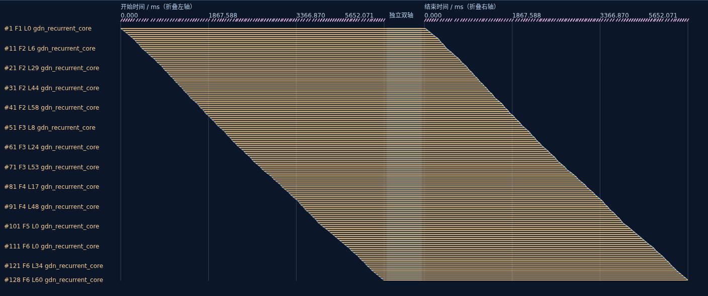
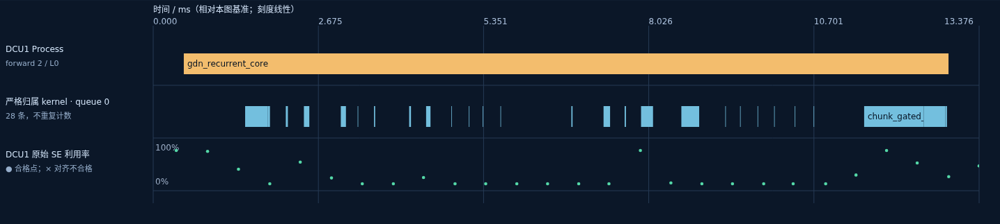
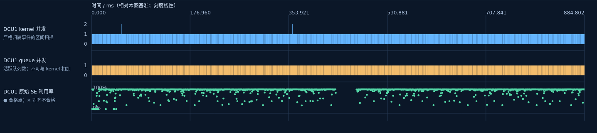
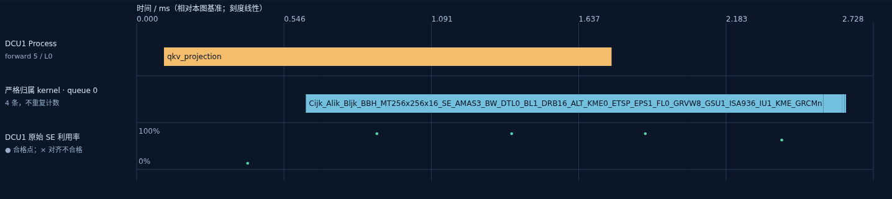
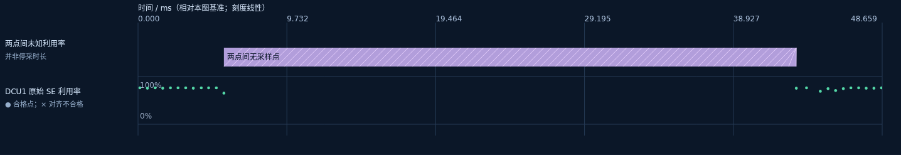

# Perf Trace 单 batch：R10 分组时间线与硬件证据

已按 Batch8 的可视化要求补齐单 batch 报告：分组梯形、可逆时间折叠、前 20 导航、真实线性时间轴、足够的矩形高度和纵向间距、逐实例硬件详情，以及精确纳秒离线浏览。

[下载完整离线报告与独立 HTML](https://github.com/cspool/auto_trace/releases/tag/perf-trace-r10-ranked-timelines-20260909-v1)。下载 `PerfTrace_single_batch_R10_ranked_timelines.zip`，解压后双击 `index.html`。无需容器、SSH、HTTP 服务或网络。单独下载 HTML 也可直接打开其时间线；跨页面链接需要对应文件在同一目录。

## 先说明 trace 范围与省略范围

这是已封存的 **20260806、物理 DCU1、单 batch / 单 Request** 示例的展示补充。没有重新运行模型、profiler 或采样，也不宣称正式重做 R09/R10。

完整数据包含 29 次 forward（6 次 prefill chunk、23 次 decode）、1,856 个 layer、17,168 个 Process、428,023 条 HIP runtime、29,964 个唯一严格归属 kernel 和 34,782 个原始 SE 利用率点。queue 与严格归属 kernel 轨道展示同一批 kernel，不能相加。完整时间线保留 **507,005 条区间**。

原 Request 长 **17.462616857 s**；默认显示至最后一个保留的非 Request 事件，跨度 **17.456503040 s**。尾部只有 Request、没有后续 Process/runtime/kernel 等 trace 的 **6,113,817 ns（6.113817 ms，约 0.0350%）** 从默认时间轴移除。原结束点 `1786095219256044373 ns` 和原始源记录保留；显示终点为 `1786095219249930556 ns`。内部空白不删除，不能据此认定设备空闲。

没有其他设备的 trace，也没有整卡所有活动的完整普查。R08 硬件计数属于重放投影属性，不能拼接成 R07 运行时间轴。FX 可见流量是推断下界；未验证的 HBM/DRAM 流量、带宽与 achieved occupancy 保留 unavailable。

## 新增可视化

| 视图 | 完整范围 | 排名与交互 |
|---|---:|---|
| 已标记高延迟 Process | 128 个实例，1 组 | phase + stage 分组，按组内观测时长总和排序；所有成员可选 |
| 硬件证据关联 Process | 26 个实例，17 组；32 行硬件属性 | 精确关联 event + stage + attachment family，显示真实 R07 时间线 |
| 设备内并发 | 29 个 forward 组 | 按严格归属 kernel 忙碌并集排序，展示 kernel 数、queue 数和原始 SE 点 |
| 原始利用率 | 17,168 个 Process，26 组 | 按组内最长窗口排序；逐点显示、不连接、不插值、不补零 |
| 未知采样间隔 | 34,781 个相邻点间隔 | 按两点时间差排序；4 个对齐不合格点另有完整表 |
| Host launch gap | 47,132 条，30 组 | stage + kind 分组，按组内最长原始 gap 排序 |

超过 20 组时默认展示前 20，支持任意起始排名和定位任意组。每组保留全部实例；完整源表可搜索和翻页。限制的是同时绘制的卡片数量，源数据未采样或截断。

每条梯形横线对应一个实例，轮廓只表达分组。默认使用独立开始/结束双轴，横线长度不代表耗时；可以切换真实单轴。折叠区间有 `//`、真实起止、间隔时长、显示权重和压缩比例，并可取消折叠。细节图始终使用线性真实时间。逐行展开为 36 px；大组每批最多 300 行，可翻批查看全部成员，避免浏览器超高 Canvas 丢图。











## 本例能说明什么

- 原高延迟列表中的 128 个实例全部属于 `prefill / gdn_recurrent_core`，总观测时长 **990,084,149 ns**，最长实例 **12,385,588 ns**。合成一组扩大了单张梯形的覆盖范围；没有新增阈值或重写高延迟分类。
- 这 128 个高延迟实例没有精确关联的 R08 硬件行，因此显示 unavailable，同时保留 R07 原始 SE 点与归属 kernel。另有 26 个 Process 精确关联 32 行 R08 属性，在补充时间线中逐条浏览；不把其他实例的硬件值借给高延迟实例。
- 同设备的观测 kernel 并发峰值为 **2**，活跃 queue 峰值为 **1**。29 个 forward 窗口内并发 ≥2 的区间并集总计仅 **10,957 ns**；这不足以作为有效并发调度或吞吐提升的证明。本例不提供 Batch8 双卡调度证据。
- 最长相邻采样点间隔为 **37,430,012 ns**。原归档缺少采样调用起止字段，它只能说明两点之间没有采样点，不能据此计算停采时长或将利用率填为 0%。Host runtime launch gap 是另一类记录，也不等于 GPU idle。

## 校验与复现

[数据审计](validation/SOURCE_AUDIT.json)独立重做 kernel / queue 端点扫描、forward 并集、分组成员与排序、硬件精确关联、相邻采样端点和 Request 裁剪计算；同时验证原归档、完整 Perfetto 字节、全量区间、离线链接。

[浏览器审计](validation/BROWSER_AUDIT.json)覆盖全部六类时间线、任意末位排名、组内选择、折叠反变换、300 行翻批、1 ns 跳转和完整时间线；无浏览器脚本错误。完整过程视图保留原 top10 配色和全部类型的矩形标签，并去掉旧版像素重叠详情的 200 条截断。

在仓库根目录执行：

```bash
python3 perf_trace/scripts/build_ranked_single_batch_timelines.py \
  --source-archive perf_trace/acceptance/workflow01-10-fresh-e2e-dcu1-20260806-r10-offline-acceptance.tar.gz \
  --full-archive perf_trace/acceptance/workflow01-10-fresh-e2e-dcu1-20260806-r10-replay002-all-rectangle-labels.tar.gz \
  --output-dir perf_trace/explanations/r10_ranked_timelines/site

python3 perf_trace/scripts/audit_ranked_single_batch_timelines.py \
  --site perf_trace/explanations/r10_ranked_timelines/site \
  --output perf_trace/explanations/r10_ranked_timelines/validation \
  --browser /path/to/chromium
```

生成器、公共时间线组件和单 batch 适配器位于 `perf_trace/scripts/`；约束已更新到 `perf_trace/skills/qwen-dcu-workflow05-trace-visualization-reporting/`。Release 中包含源码、日志、审计、全部排名、原始封存归档和完整 Perfetto JSON。`FILE_MANIFEST.json` 与 `SHA256SUMS` 支持校验和恢复。

此前 Batch8 的尾部裁剪、分组梯形与硬件报告也已发布：[Batch8 R10 Release](https://github.com/cspool/auto_trace/releases/tag/perf-trace-batch8-r10-ranked-timelines-20260909-v1)。
