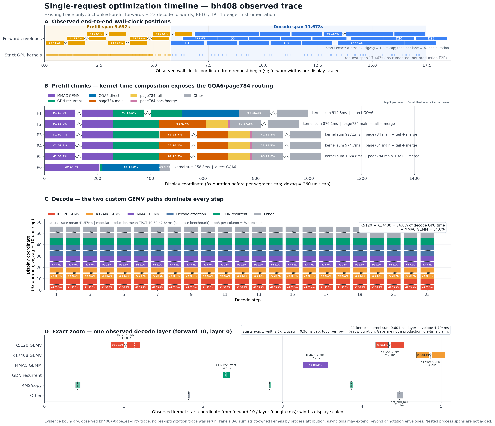
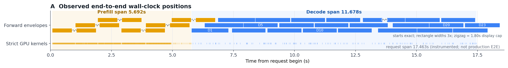
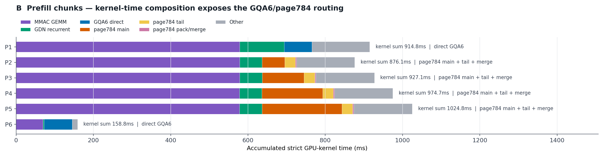
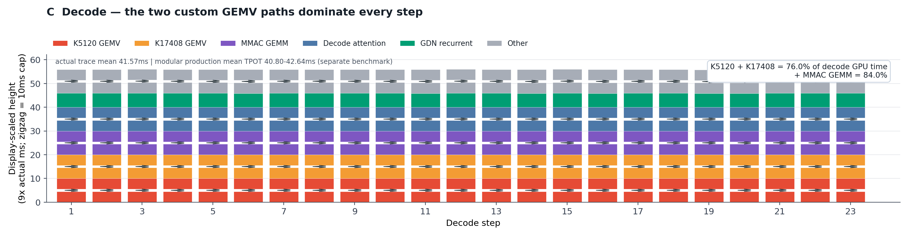
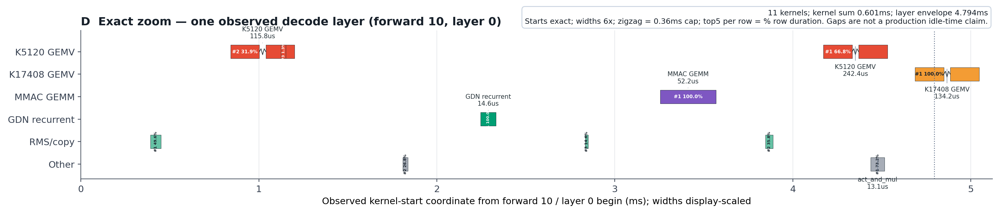

# 单 Batch 主要优化：按 A–D 分图阅读

[下载完整 PDF 报告](./single_batch_optimization_timeline_report.pdf)

这组图回答两个问题：一次优化后的单请求是怎样执行的，以及主要优化落在
prefill 还是 decode。建议按 **A → B → C → D** 阅读：先定位两个阶段，再看
prefill 路由、decode 主成本，最后放大到一个 decode layer。

> A–D 展示的是同一次**优化后 trace**，不是 before/after 曲线。图旁的历史
> 收益来自独立的固定 benchmark；不能用图中柱长直接计算优化幅度。
>
> 为让最短矩形可辨，A/B 沿时长方向放大 `3×`，C 沿纵向放大 `9×`，D 沿
> 横向放大 `6×`；超过各图显示上限的长块用折线断口拼接两个矩形表示。A/D
> 的起点和所有文字数字仍是真实观测值；B/C 的矩形长度是显示尺度，不能越过
> 折线按坐标反推真实时长或占比。
> 导出画布、坐标轴和块内文字已同步放大；A/B/D 的矩形通过各自纵轴范围和面板
> 高度动态换算为完全相同的物理高度，并在统一后整体增高 `25%`；A 的 strict
> 时间带为新高度的 `1/2`；C 的
> 柱宽单独放大。上述时长显示倍率不变，轴域由放大后的矩形边界重新计算，因此物理尺寸
> 变大不会改变数字、比例或折线断口的含义。
> A/D 的轴刻度定位真实起点，右边界为
> `起点 + min(倍率×真实时长, cap)`；B/C 是累计显示坐标，后一块边界等于前一
> 边界加 `min(倍率×该块真实时长, cap)`。因此折线后的边界是显示边界，不是
> 可直接读取的真实结束时间。
> 左下角坐标值只标每条时间线或每根柱内按真实 duration 排名最大的 3 个矩形：
> A/D 标混合轴上的真实 start，B/C 标累计显示轴上的左/下边界。D 的数字从块内
> 移到对应边界外侧；折叠矩形不再标锯齿两侧或右/上边界。
> 矩形内主标签保持单行水平显示，固定字号在上一版基础上扩大 `2×`；边界坐标
> 数字为前一版字号的 `2/3`。生成时按最终像素检查，无法在对应可见块内水平容纳的主
> 标签不显示，不换行、不旋转，也不允许文字越过矩形边界。Top‑3 左下角坐标
> 数字保持放大显示。
> 相邻时间线/柱之间保留更大的空白间距，并同步扩大画布，避免间距增加后压缩
> 矩形。矩形边界坐标值也使用放大字号。
>
> “前 5”块内主标签在每条线/每根柱内独立计算：A 的每条 forward 子时间线、B 的每条
> prefill 横柱、C 的每根三步均值竖柱、D 的每条 kernel 类别时间线分别标出
> duration 最大的 5 个矩形（不足 5 个则全部标）。块内百分比的分母是该线或
> 该柱的真实 duration 总和，不由放大后的矩形面积计算。

<details>
<summary>展开完整 A–D 总览图</summary>

[](./single_batch_optimization_timeline.svg)

</details>

## A. 请求全貌：先区分 prefill 和 decode

[](./panel_a_request_overview.svg)

**坐标轴含义**：横轴是混合显示坐标，矩形左边界取真实 request-relative
forward 起点，右边界为 `起点 + min(3×真实时长, 1.80 s)`；因此刻度可读取
真实起点，但放大后的右边界不是 forward 的真实结束时间。纵轴是分类轨道：
上方三条子时间线放 forward envelope（一次 forward 从观测开始到结束的
wall-clock 包络），下方时间带放 strict-owned GPU
kernel 的真实起止位置；strict 时间线高度是上方每条 forward 矩形的 `1/2`。
三条 envelope 轨道仅按 forward 编号轮流排布以避免矩形遮挡，不表示三路并发；
并发关系不能由这三条显示轨道推断。图内显示规则和 request span 统一放在图的
最下方，字号与坐标轴标签一致；A 的纵轴轨道名按短行纵向堆叠，以减少左侧占宽。

怎么看：

- 上排矩形是 29 次 forward：橙色 `P1–P6` 是 6 个分块 prefill，蓝色
  `D1–D23` 是 23 个逐 token decode forward envelope，不是单个 kernel。
  每个矩形右上角统一标注 forward ID：`P1–P6` 是 prefill chunk ID，`D1–D23`
  是 decode step ID；字号与左下角坐标数字相同。这些 ID 不是时长、排名或
  kernel 数量。
  `D*` 看起来较宽，是因为图中宽度使用 `3×真实 forward 时长`，并在 `1.80 s`
  达到显示上限后折叠：本 trace 的真实时长为 `0.460–0.601 s`，显示宽度为
  `1.381–1.800 s`。实际起点仍由横轴读取，显示右边界不是实际结束时间。
- 下排 strict 时间带由这些 forward 归属的 strict-owned GPU kernels 组成，用来
  确认 GPU 工作实际落在什么位置；其横向起止仍使用真实 trace 坐标。
- 本次观测中，prefill span 约 `5.692 s`，decode span 约 `11.678 s`，请求
  span 约 `17.463 s`。

结论：这个请求先用 6 个 chunk 处理输入，再连续生成 23 个 token。A 只负责
建立全局位置；它是带 eager instrumentation 的观测时间，不代表生产 E2E，
也不单独证明某项优化带来多少收益。

## B. Prefill：GQA6 与 page784 分别处理不同 chunk

[](./panel_b_prefill_routes.svg)

**坐标轴含义**：横轴是每个 prefill 行内部的累计显示坐标，每个块满足
`右边界 = 左边界 + min(3×真实 kernel duration(ms), 260)`；横轴刻度、块边界
旁数字和折叠断口均使用同一显示单位。纵轴是 6 个 prefill forward/chunk 的
分类编号 `P1–P6`，不是连续时间。

每根横柱对应一个 prefill forward，各颜色来自该 forward 内 strict-owned kernel
duration 的累加；矩形按上述 `3×` 显示规则绘制，右侧 `kernel sum` 是真实总时长。
数字之间的关系如下：

- **`GQA6 direct`（P1、P6）**：对同一个 `KV head × 32-query block`，grid
  第三维启动 3 个 CTA，分别处理 3 组 `2 Q heads`，合计覆盖该 KV head 的
  6 个 Q heads。每个 CTA 的 `2 heads×32 queries=64` 是 64 个
  **query/head 行**，不是 64 个 token；该 CTA 逐个扫描 64-token K/V tile，
  再把每个 tile 沿 K/V-token 轴拆成 `2×32 tokens` 更新 softmax 和 `P@V`。
  两个“64”分别位于 Q 行轴与 K/V token 轴，并在当前 Q block 的 causal 上界停下。
- **`page784`（P2–P5）**：`784=12×64+16`。前 `768` tokens 走 64 对齐的
  paged attention，剩余 `16` tokens 打包后走 contiguous attention，最后用
  FP32 log-sum-exp 合并。组合后可复用 64-token kernel，而不必展开完整 KV cache。
- **`MMAC GEMM`（紫色）**：`M=4096` 是完整 prefill chunk 的 token 行数，
  不是模型 hidden size；固定这一维后可直接复用已选好的 TunableOp solution。

### B 中优化所在的 full-attention process

**算子链**：固定输入 FX 样本
[`input1_layer3`](../../../workload_profile/fx/traces/20260729T050800Z-fx-89687ae2-R032-qwen35-27b-eager-row0-hcu0/input1_layer3/fx_process_reconstruction.md)
观测到 `q=4096`、`past=0`。FX 中可见的依赖顺序是
`aten.add → FP32 RMSNorm(_to_copy/pow/mean/add/rsqrt/mul) → aten.mm →
split_with_sizes/view/split → Q/K RMSNorm → RoPE(index/slice/mul/sub/add/cat) →
vllm.unified_kv_cache_update → vllm.unified_attention_with_output →
view/sigmoid/mul → aten.mm/copy_/aten.add`。其中第一个 `aten.mm` 完成
`[4096,5120]×[5120,14336]→[4096,14336]`，最后一个完成
`[4096,6144]×[6144,5120]→[4096,5120]`。

下面按观测 shape 画张量轴；宽度做了压缩，数字端点是精确值：

<pre>
Tensor: HN, shape=[4096, 5120]
Formula: HN = RMSNorm(HIDDEN + RESIDUAL)
feature      0                                      5120
             +-----------------------------------------+
token 0      |            NORM_HIDDEN_ROWS             |
token 4095   +-----------------------------------------+
                              |
                              | P = HN @ W_QKVZ.T
                              v

Tensor: P, shape=[4096, 14336]
Formula: split(P) = [QZ, K, V]
channel      0                         12288     13312    14336
             +---------------------------+---------+---------+
token 0      | QZ: 24 x (256 + 256)     | K:4x256 | V:4x256 |
token 4095   +---------------------------+---------+---------+
                              |
                              | Q,K: RMSNorm -> RoPE(first 64/256)
                              | K,V: KV cache update; <strong>24/4 = GQA6</strong>
                              v

Tensor: G, shape=[4096, 6144]
Formula: G = reshape(<strong>UNIFIED_ATTN(Q, K, V)</strong>) * sigmoid(reshape(Z))
head-feature  0                                      6144
              +-----------------------------------------+
token 0       |       GATED_ATTENTION_CONTEXT           |
token 4095    +-----------------------------------------+
                              |
                              | Y = G @ W_O.T + RESIDUAL
                              v

Tensor: Y, shape=[4096, 5120]
Formula: Y = ATTENTION_OUTPUT + RESIDUAL
feature      0                                      5120
             +-----------------------------------------+
token 0      |          ATTENTION_RESIDUAL             |
token 4095   +-----------------------------------------+
</pre>

`unified_attention_with_output` 是 FX 中的 opaque custom-op 边界，内部 kernel
没有被 FX 展开；B 图的 runtime trace 才进一步表明该边界内命中了 GQA6 direct
或 page784。page784 的切分关系是：

<pre>
Tensor: KV_PAGE, shape=[784, 4, 256]
Formula: KV_PAGE = MAIN[0:768] || TAIL[768:784]
token-in-page  0                                  768     784
               +------------------------------------+-------+
               |          <strong>MAIN: 12 x 64</strong>             |<strong>TAIL:16</strong>|
               +------------------------------------+-------+
</pre>

GQA6 direct 仅用于 gfx936/BF16、`head_dim=256`、`page=784`、单序列且
`q≥128` 的长 prefill；这里 `256` 是每个 head 的特征宽度，`128` 是启用长
query 路径的最小 query-token 数。其他情况回退原 attention 路径。

`P6` 是较短的末尾 chunk，所以它明显更短；不能拿它与完整 chunk 的柱长相除，
当作 GQA6 的加速倍数。

对应方向的历史闭环结果（独立 benchmark）：H11.5 GQA6 prefill 相对 R24 的
小样本 TTFT 降幅，在 4–8K、8–16K、16–32K 三档分别为 `15.89%`、
`20.47%`、`24.65%`。三档表示输入 token 长度；TTFT 是“请求到首 token”的
时间，因此这些数字表示 prefill 后首 token 更早返回，不表示 decode 单 token
快了同样比例。

## C. Decode：两条专用 GEMV 是主要优化落点

[](./panel_c_decode_composition.svg)

**坐标轴含义**：横轴把连续 3 个 decode step 合为一组，显示 `1–3`、`4–6`
等 8 组（最后一组为 `22–23`）；纵轴是每根组均值柱内部的累计显示坐标，每段满足
`上边界 = 下边界 + min(9×真实 kernel duration(ms), 10)`。纵轴刻度和矩形
边界数字均为显示坐标。每段的真实 duration 是该组 2–3 个 step 的算术平均；
每根组均值柱按平均 duration 独立选 Top‑5，块内写 `#排名 + 平均时长(ms)`，
平均时长保留小数点后 3 位，排名不使用放大后的矩形高度。C 面板物理高度增加
`25%`，折叠锯齿同时加粗并扩大横向振幅，断口只表示超过显示 cap。

每根柱代表一组相邻且组成基本相同的 decode step，而不是将某一个 step 重复
三次。这里 `K` 是每个输出值需要点积的输入长度，`M`
是输出通道数，`n=1` 表示一次只计算 1 个 decode token；gfx936 的 1 个 wave
包含 64 个并行 lanes：

- **`K5120 GEMV`（红色）**：`gate_up_proj` 的 `M=34816`，每个 CTA 算 2 个
  输出行，因此启动 `34816/2=17408` 个 CTA。每个 CTA 固定为
  `640 threads=10 waves×64 lanes`，不是 20 waves。同一 CTA 内，thread `t`
  计算第 `t` 个 8-BF16 输入块与两条权重行（对应 2 个输出行）的对应块点积，
  因而 `640×8=5120`，每个 thread 为每行各得到一个 8 项局部和。随后 thread
  `t`（`0≤t<320`）加上 thread `t+320` 的局部和，形成 320 个各含 16 项的
  部分和；这 320 threads 正好是 5 waves，每个 wave 归约 64 个部分和得到
  1 个 wave 和，最后将 5 个 wave 和相加，得到每行完整的 5120 项点积；两行
  分别写出 1 个结果。
  其他 shape gate 同理按 `CTA数=M/每CTA行数`：`M=96` 时为 4 行/CTA、24 CTAs，
  `M∈{14336,16384,34816,248320}` 时为 2 行/CTA。
- **`K17408 GEMV`（橙色）**：一个 CTA 负责 `down_proj` 的一个输出行，即把
  `[1,17408]` 输入与一条长度 17408 的权重行做点积。17408 个 BF16 元素分成
  2176 个 8 元素块；CTA 内 1024 threads 中，`0–127` 各处理 3 块，其余
  896 threads 各处理 2 块，即 `128×3+896×2=2176`。随后
  `1024=16 waves×64 lanes` 合并所有部分和，写出 1 个 BF16 结果；`M=5120`
  因而启动 5120 个 CTA，完成 `[1,17408]→[1,5120]`。

### C 中优化所在的 gated-MLP process

**算子链**：固定输入 FX 样本
[`input7_layer3`](../../../workload_profile/fx/traces/20260729T050800Z-fx-89687ae2-R032-qwen35-27b-eager-row0-hcu0/input7_layer3/fx_process_reconstruction.md)
观测到 `q=1`。具体依赖顺序是
`post-attention FP32 RMSNorm → BF16 _to_copy → get_attr/aten.t → aten.mm
(K5120) → aten.empty → _C.silu_and_mul → get_attr/aten.t → aten.mm
(K17408) → output`。FX 中的两个 `aten.mm` 在 runtime backend 分别 dispatch
到 K5120 和 K17408 GEMV。`_C.silu_and_mul` 只暴露调用和输出 buffer 边界；
这里的 `SiLU(gate)⊙up` 是该算子的功能关系，不把其内部实现伪装成已重建的 ATen
节点。

下面的矩形表示一个 decode token 的通道轴；宽度做了压缩，数字端点是精确值：

<pre>
Tensor: H, shape=[1, 5120]
Formula: H = BF16(RMSNorm(ATTENTION_RESIDUAL))
channel  0                         5120
         +----------------------------+
token 0  |      NORM_HIDDEN_ROW       |
         +----------------------------+
                       |
                       | <strong>K5120 GEMV: GU = H @ W_GATE_UP.T</strong>
                       | W_GATE_UP = [34816, 5120]
                       v

Tensor: GU, shape=[1, 34816]
Formula: GU = concat(GATE, UP), width(GATE) = width(UP) = 17408
channel  0                           17408                          34816
         +------------------------------+------------------------------+
token 0  |          GATE_HALF           |           UP_HALF            |
         +------------------------------+------------------------------+
                         \                         /
                          \ A = SiLU(GATE) * UP   /
                           v                     v

Tensor: A, shape=[1, 17408]
Formula: A = SiLU(GATE) * UP
channel  0                                           17408
         +-----------------------------------------------+
token 0  |             ACTIVATED_MLP_ROW                 |
         +-----------------------------------------------+
                               |
                               | <strong>K17408 GEMV: D = A @ W_DOWN.T</strong>
                               | W_DOWN = [5120, 17408]
                               v

Tensor: D, shape=[1, 5120]
Formula: D = MLP_DELTA
channel  0                         5120
         +----------------------------+
token 0  |         MLP_DELTA          |
         +----------------------------+
</pre>

该 layer 的 FX output 是 `(D, ATTENTION_RESIDUAL)`，没有在这张固定输入图中再做
最终 residual add。两条 GEMV 组合后覆盖 MLP 两端的大投影；中间的
`silu_and_mul` 仍是独立算子，文档不把它计作 GEMV 融合收益。

两者仅在 gfx936、BF16、单 token、无 bias、连续且 16-byte 对齐时启用；其余
shape 回退原 GEMM。本次 trace 中两条 GEMV 占 decode kernel 累加时间的
`76.0%`，加上 MMAC GEMM 为 `84.0%`；这是**时间组成占比**，不是加速比。
`41.574 ms` 是 23 个 decode steps 的平均 kernel 累加值，也不是单步 wall-clock。

因此，降低单 Batch TPOT 的首要目标很清楚：优先缩短反复出现在每个 token
中的 K5120 和 K17408 投影，而不是只优化一次性的初始化工作。

对应的历史闭环结果（独立 benchmark）如下。TPOT 是生成一个输出 token 的平均
时间；吞吐是完整请求每秒生成的 token 数：

| 对比 | 4–8K | 8–16K | 16–32K |
| --- | ---: | ---: | ---: |
| H10.8 K5120 GEMV 相对 H11.5：小样本 TPOT 降幅 | `5.23%` | `5.03%` | `4.91%` |
| H11.5 + H10.8 相对 R24 full 均值：吞吐提升 | `6.744%` | `9.540%` | `13.724%` |

这里的 **H11.5 + H10.8** 特指在同一 build 中同时启用 GQA6 prefill 与
K5120 decode 快路径：它能同时缩短首 token 等待和后续逐 token 生成。组合收益
不能用两个降幅直接相加；表中的 full 吞吐提升是重新运行完整请求得到的联合结果。

`full×3` 表示连续 3 轮完整测试，每轮 150 个请求；`450/450` 表示全部成功。
TTFT/TPOT SLA 通过表示延迟未越过规定上限，accuracy `K=1.0` 表示固定精度
评测没有扣分。这些是本地闭环结果，不是平台官方分数。

## D. 单层放大：确认优化 kernel 确实落在执行序列中

[](./panel_d_decode_layer_zoom.svg)

**坐标轴含义**：D 中所有时间统一使用 `us`。横轴是混合显示坐标，矩形左边界
为相对该 layer 起点的真实 kernel start，右边界为
`start + min(6×真实 duration, 360 us)`；所以刻度
定位真实启动位置，不能把放大后的右边界当成真实完成时间。纵轴是 strict-owned
kernel 类别，不表示连续数值。

D 只放大 `forward 10 / layer 0`。横轴用相对该 layer 开始的真实启动坐标定位
每个矩形左边界，再用显示倍率画宽度；纵轴按 kernel 类别分行，因此能直接看到
K5120、K17408、MMAC GEMM、GDN recurrent 以及 RMS/copy 在一次真实 layer
中的启动位置。图名统一声明所有时间单位均为 `us`；kernel 类别、行内
排名和真实 duration 全部放在矩形上方或下方，启动坐标数字放到矩形另一侧，
矩形内部不显示文本。

这个样本包含 11 个 strict-owned kernels：kernel duration 累加约
`601 us`，layer annotation envelope 约 `4794 us`。D 的用途是验证“专用
kernel 已进入目标执行路径”，不是把矩形之间的空隙解释成性能损失。空隙还可能
包含 eager、runtime、异步执行与 tracing 影响，不能称为生产 GPU idle。

## 配套优化如何理解

GDN recurrent、连续 M-RoPE copy、RMS/copy 和若干严格 shape-gated 路径也在
减少计算或调度开销；它们在 B–D 中作为组成项出现。由于本图没有为这些路径构造
独立 before/after 对照，文档不从单次 trace 推导它们各自的端到端收益。

## 证据边界与复现

- B、C 是 strict-owned kernel duration 的**累加值**，不是 wall-clock；异步
  尾部可能越过上层 annotation envelope。
- process 区间可能嵌套，不能相加后当作请求耗时。
- A–D 来自已接受 trace，不重新运行模型、profiler 或加速卡。输入是
  [`replay002` acceptance 归档](../../acceptance/workflow01-10-fresh-e2e-dcu1-20260806-r10-replay002-all-rectangle-labels.tar.gz)。

复现时运行：

```bash
python perf_trace/explanations/single_batch_optimization_timeline/build_timeline.py
```

脚本会同时生成完整总览图和 A–D 四组独立的 PNG/SVG，文档默认显示 PNG，点击
后可打开 SVG 无损放大。当前图的矩形物理尺寸、字体层级、坐标轴语义和面板必备
内容已固化为
[`build-optimization-trace-report` 视觉参考规范](../../skills/build-optimization-trace-report/references/current-figure-reference.md)，
用于生成其他 trace 报告时复用；其中当前 trace 的倍率和 cap 仅作为示例参数。

<!-- pdf-build-instructions:start -->
安装 `weasyprint` 与 `markdown-it-py` 后，可将包含中文字体的报告导出为 PDF：

```bash
python perf_trace/explanations/single_batch_optimization_timeline/build_pdf.py \
  --font /path/to/NotoSansCJKsc-Regular.otf
```
<!-- pdf-build-instructions:end -->
