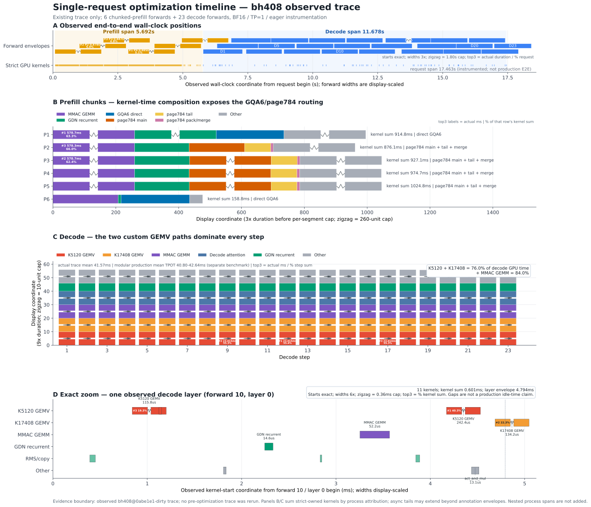

# 单 Batch 主要优化：从时间线理解

下图把单请求、单卡、`TP=1` 的一次已观测执行拆成四层：完整请求时间线、
prefill 组成、逐 token decode 组成，以及一个代表性 decode layer 的精确 kernel
位置。点击 PNG 可打开 SVG 无损放大版本。

[](./single_batch_optimization_timeline.svg)

> 这是一张**优化后执行结构图**，不是在同一坐标轴上叠加的 before/after
> 曲线。图中 trace 来自 BF16、单卡、eager instrumentation；历史对比收益来自
> 独立的固定吞吐、SLA 与 accuracy 闭环。两类证据不能混为一谈。

## 一句话结论

单 Batch 的主要优化集中在两个阶段：prefill 通过 GQA6 专用 attention 和
page784 拆分/合并降低长上下文 attention 成本；decode 通过 K=5120 与
K=17408 两条专用 GEMV 快路径压缩单 token 投影时间。图 C 显示，这两条
GEMV 在该次 trace 中占 decode strict-owned GPU kernel 时间的 **76.0%**；
连同 MMAC GEMM 后占 **84.0%**，因此 decode 优化的主要落点非常明确。

## 主要优化与图中位置

### 1. Wide-causal GQA6 prefill

- 面向 `gfx936 + BF16 + head_size=256 + GQA6 + 单序列长 prefill` 精确命中，
  其他 shape 回退原实现。
- 将一个 KV head 对应的 6 个 query heads 分组处理，并利用 causal 上界减少
  无效 K/V 工作；逻辑 K/V tile 分成较小数值子块，以降低同时存活的寄存器。
- 图 B 中 P1、P6 走 `GQA6 direct`。P6 是较短的末尾 chunk，不能仅凭柱长
  与其他完整 chunk 直接比较加速倍数。

### 2. Page784 later-prefill

- 784-token cache page 不能直接满足 64-token 对齐要求，因此拆为
  `768-token main + 16-token tail`。
- 主体使用 paged attention，尾部按逻辑顺序打包后使用 contiguous attention，
  最后用 FP32 log-sum-exp 合并各 attention state，避免展开完整 KV cache。
- 图 B 中 P2–P5 的 `page784 main / tail / pack/merge` 颜色展示了这条路由的
  实际组成，而不是额外复制出的估算时间。

### 3. K=5120 decode GEMV

- 为 Qwen3.5 单 token 投影提供 640-thread pair-reduction kernel，并按目标
  输出行数选择 row2/row4；只有冻结的 BF16、连续、对齐 shape 才会命中。
- 该路径对应图 C、D 中占比最大的红色 `K5120 GEMV`。它反复出现在每个
  decode step，是降低 TPOT 的核心快路径。

### 4. K=17408 输出投影 GEMV

- 为 `K=17408` 输出投影提供专用 BF16 kernel，在目标 shape 内使用局部
  FP32 FMA 累加和固定归约；未命中时仍回退原 GEMM 路径。
- 图 C、D 中橙色 `K17408 GEMV` 紧随 K5120，是第二个稳定的 decode 主成本。

### 5. 配套优化

- M=4096 prefill linear 使用冻结的 ROCm TunableOp solution，主要体现在图 B
  的 `MMAC GEMM` 部分。
- GDN recurrent、连续 M-RoPE copy 和若干严格 shape-gated 路径减少计算或
  调度开销，但本图没有为它们单独构造 before/after 对照，因此不从图中宣称
  独立端到端收益。

## 如何阅读四个面板

| 面板 | 展示内容 | 可得到的结论 |
| --- | --- | --- |
| A | 6 个 prefill forward、23 个 decode forward 及 strict-owned kernels 的真实位置 | 请求由约 `5.692 s` prefill span 和 `11.678 s` decode span 构成；总 `17.463 s` 是带 instrumentation 的观测 span |
| B | 每个 prefill chunk 的 strict-owned kernel 累加时间 | 能看到 GQA6 direct 与 page784 路由，以及 GEMM/attention/GDN 的组成；柱长不是 wall-clock |
| C | 23 个 decode step 的 kernel 时间组成 | 单步平均约 `41.574 ms`；K5120、K17408 是主要优化杠杆 |
| D | forward 10、layer 0 的 11 个 kernel 精确位置 | kernel 累加约 `0.601 ms`，layer envelope 约 `4.794 ms`；二者差值包含 eager/runtime/tracing 影响，不能直接称为生产空闲时间 |

## 已闭环的历史对比

以下数字用于回答“优化前后差多少”，与图中的单次 instrumentation trace 分开：

| 优化 | 对照 | 4–8K | 8–16K | 16–32K |
| --- | --- | ---: | ---: | ---: |
| H11.5 GQA6 prefill | 相对 R24，小样本 TTFT 降幅 | `15.89%` | `20.47%` | `24.65%` |
| H10.8 K5120 GEMV | 相对 H11.5，小样本 TPOT 降幅 | `5.23%` | `5.03%` | `4.91%` |
| H11.5 + H10.8 | 相对 R24 full 均值，吞吐提升 | `6.744%` | `9.540%` | `13.724%` |

组合版本完成 full×3，共 `450/450` 请求成功，TTFT/TPOT SLA 通过，固定
accuracy 为 `K=1.0`。这些是本地闭环结果，不应表述为平台官方分数。

## 证据边界

- 图 B、C 使用 strict-owned kernel duration 的**累加值**，不是端到端
  wall-clock；异步尾部可能越过上层 annotation envelope。
- process 区间可能嵌套，不能相加后当作请求耗时。
- 图 D 中的空隙包含 eager、runtime 与 tracing 开销，不证明生产 GPU idle。
- 图来自已接受 trace，不重新运行模型、profiler 或加速卡；生成脚本只读取
  [`replay002` acceptance 归档](../../acceptance/workflow01-10-fresh-e2e-dcu1-20260806-r10-replay002-all-rectangle-labels.tar.gz)。

复现图片可运行：

```bash
python perf_trace/explanations/single_batch_optimization_timeline/build_timeline.py
```
