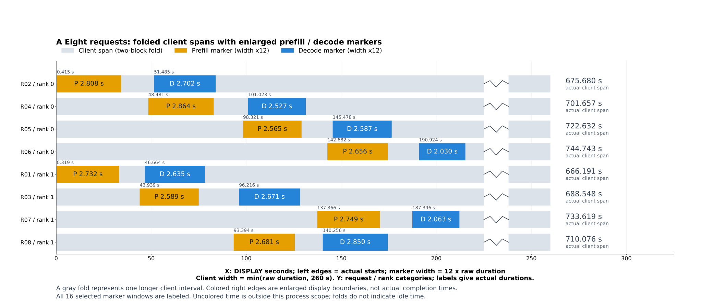
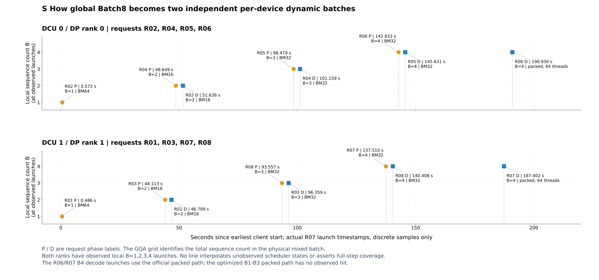
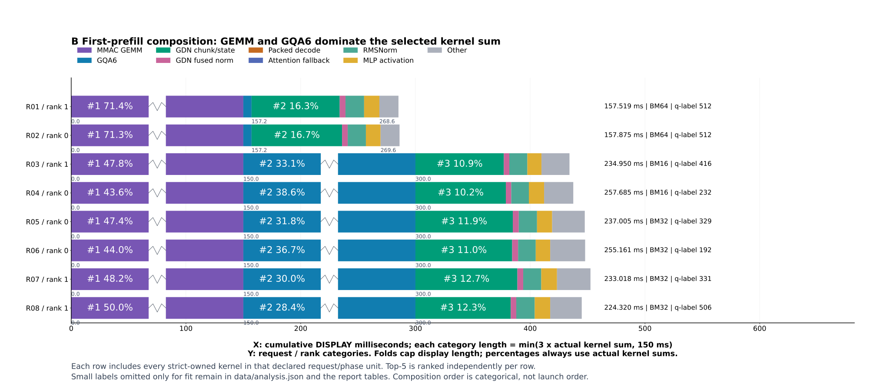
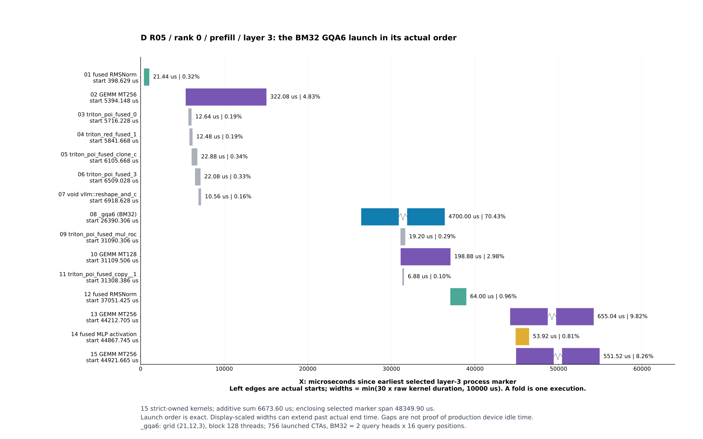
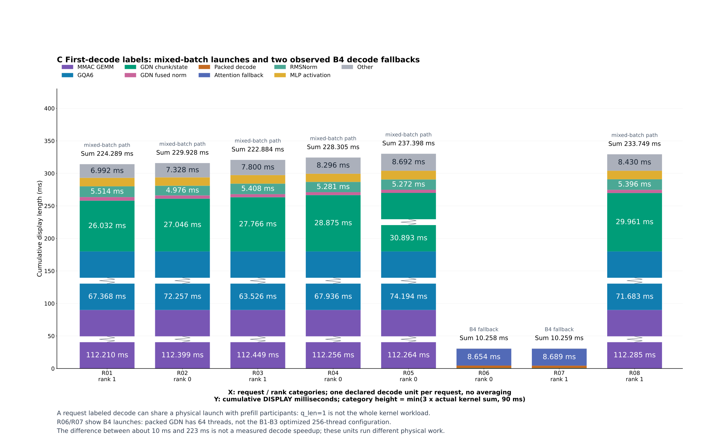

# Batch8 双卡调度设计与 OOM 处理：可视化分析报告

**实际设计由三层组成：前端按请求负载把八并发分发到两个完整模型副本；每卡独立 continuous batching，用按输入长度分档的 prefill token 预算控制显存峰值；kernel 再按实际单卡 batch 选择配置。** 选卡沿用官方 DP 负载均衡，优化重点是每卡的工作集控制、Graph 内存保护和适配 local batch 的算子路径。

目标配置为 Qwen3.5-27B、BF16、gfx936，`DP=2 / TP=1 / PP=1`。本报告先解释实际代码中的调度与 OOM 处理，再用已经验收的 `batch8-dp2-fresh-003` 固定 trace 作时间线示意。图中的 4+4 是示例分配；服务对每个到达请求独立选卡，分配比例随两卡负载变化。

报告采用 AutoTrace 的 `build-optimization-trace-report` skill。图中时间来自 R07 原始观测及已验收 R09/R10 数据，覆盖八请求客户端区间，以及每请求首个 prefill、首个 decode 各 784 个声明 process 目标；每请求输出 1024 token。历史 OOM 消融另列在第三节。

## 1. 最初的 8 个并发请求怎样调度到双卡

### 1.1 服务拓扑与逐请求选卡

`serve_cscc_dp2.sh` 以 `--data-parallel-size 2 --tensor-parallel-size 1 --data-parallel-backend mp` 启动服务。两张卡各运行完整模型，各自拥有 EngineCore、调度器和 KV cache。客户端的 Batch8 表示最多 8 个请求同时在途；前端每收到一个请求就选定一个 EngineCore，无需等到八个请求全部到齐。

**选卡发生在 `DPLBAsyncMPClient.get_core_engine_for_request()`。** 普通生成请求未指定 rank 时，前端读取两卡的等待数和运行数，分别计算 `score = 4 × waiting + running`，将整个请求发送到分数较低的 EngineCore。例如 rank 0 为 `(waiting=1,running=2)`、rank 1 为 `(0,3)`，分数为 6 和 3，下一请求就进入 rank 1。等待请求的权重更大，可避免新请求持续堆积到同一副本。

选定后，前端立即把该卡的本地 waiting 计数增加 `client_count`，在协调器约 100 ms 的统计更新之间反映新负载。同分时，从 `floor(num_engines × client_index / client_count)` 对应的卡开始扫描，保留扫描到的第一个最小值；这能让不同 API 前端在空载时分散选择。

<pre class="process-art">
on_each_request(request):
    if request.data_parallel_rank is specified:
        rank = request.data_parallel_rank
    else:  # ordinary generation request
        <strong>rank = argmin_over_engines(4 * waiting[rank] + running[rank])</strong>
        waiting[rank] += client_count
    send_ADD(request, EngineCore[rank])
</pre>

因此八请求在负载相近时可形成接近 4+4 的分流；后续有请求完成、排队长度变化，下一请求的目标卡也可改变。当前设计保留官方请求数负载均衡；输入长度用于每卡内部预算。跨卡按 prompt token 总量再做 tie-break 尚未实现：多个 API 前端的局部 token 计数不能直接当作全局计数，精确实现需要共享状态或协调器协议支持。

### 1.2 选卡之后，两个调度器独立推进

一个请求进入选定 EngineCore 后，在该副本内推进 prefill 和 decode。每卡从自己的 waiting/running 队列选择本步工作，不必凑齐 local B4；因此开始阶段可出现 B1，之后逐步形成 B2、B3、B4，以及 prefill/decode 混合 batch。请求完成时该卡的负载下降，前端之后的选卡会反映这一变化。

<pre class="process-art">
                    8 concurrent client requests
                                  |
              <strong>per-request DP routing: min(4*waiting + running)</strong>
                         /                    \
                        v                      v
               EngineCore / rank 0     EngineCore / rank 1
               DCU 0, full model       DCU 1, full model
               own scheduler + KV     own scheduler + KV
                        |                      |
               <strong>independent continuous batching</strong>
                        |                      |
               remaining prefill?     remaining prefill?
               <strong>length-tier token budget: 2048 / 1024 / 512</strong>
                        |                      |
               actual local B         actual local B
               -> kernel config       -> kernel config
</pre>

以下 4+4 固定 trace 用于展示这套设计在两个副本上的执行路径。采集请求显式指定的 rank 与原生 kernel 归属一致；它展示分卡后的 batch 演进，默认选卡算法由上述实际源码说明。逐请求的采集分配和原始时间保存在 [调度设计与证据记录](data/scheduling_design.json)。

| 设备 / rank | 本例请求 | 输入 token 总数 | 输出 token 总数 | 请求数 |
| --- | --- | --- | --- | --- |
| 0 | R02, R04, R05, R06 | 85,843 | 4,096 | 4 |
| 1 | R01, R03, R08, R07 | 84,781 | 4,096 | 4 |

两卡输入 token 总量分别为 85,843 和 84,781，差值 1,062，相对均值差约 1.24%。全部 8 个请求共同处于客户端在途状态的交集为 **666.185 秒**。这证明本例八并发已形成，4 个请求也都实际落到了各自设备。

源代码：[服务拓扑](source_snapshot/scripts/serve_cscc_dp2.sh)、[请求选卡](source_snapshot/vllm/v1/engine/core_client.py)。

<figure class="report-figure"><figcaption>图 A：灰色客户端长区间以两块折叠矩形表示，显示宽度上限 260 秒；彩色 Marker 宽度统一放大 12 倍。所有左边界仍对应真实启动位置，矩形内标注原始时长；右边界属于显示坐标。</figcaption></figure>

## 2. 同一张卡上的 batch 怎样从 1 增至 4

把每个声明请求/阶段的首个 GQA 或 packed decode 启动定位出来，可以看到两卡都出现了 **B1 → B2 → B3 → B4** 的实际启动。这里的 B 是这次物理 kernel 接收的序列数：GQA 的 `gridDimZ` 直接给出序列数；packed decode 的 `gridDimY / 48` 给出序列数。

每张卡最早处理一个长请求的 prefill；后续请求开始 prefill 时，已有请求可以同时推进 decode。因此同一个物理 batch 中会出现 prefill 和 decode 混合。R01 的记录名虽然是 decode，但此时 rank 1 的 GQA 启动已经处理两个序列；后面的 R03 decode 记录对应三个序列。这正是“请求自己的阶段”和“整张卡当前 batch”之间的关系。

<figure class="report-figure"><figcaption>图 S：恢复真实秒数横轴，每卡一幅时间图。圆点给出准确的启动时刻与单卡 B；大信息矩形的左边界与该时刻对齐，直接显示请求阶段、时间和 kernel 配置。矩形宽度固定为 43 显示秒，仅用于放大标注，右边界不代表执行结束。</figcaption></figure>

| 卡 | 请求 / 阶段 | 启动位置（s） | 单卡 B | 实际路径 / 配置 |
| --- | --- | --- | --- | --- |
| 0 | R02 prefill | 0.572 | 1 | GQA BM64 |
| 0 | R04 prefill | 48.649 | 2 | GQA BM16 |
| 0 | R02 decode | 51.636 | 2 | GQA BM16 |
| 0 | R05 prefill | 98.479 | 3 | GQA BM32 |
| 0 | R04 decode | 101.159 | 3 | GQA BM32 |
| 0 | R06 prefill | 142.833 | 4 | GQA BM32 |
| 0 | R05 decode | 145.631 | 4 | GQA BM32 |
| 0 | R06 decode | 190.930 | 4 | packed B4 / 64 threads |
| 1 | R01 prefill | 0.486 | 1 | GQA BM64 |
| 1 | R03 prefill | 44.113 | 2 | GQA BM16 |
| 1 | R01 decode | 46.799 | 2 | GQA BM16 |
| 1 | R08 prefill | 93.557 | 3 | GQA BM32 |
| 1 | R03 decode | 96.359 | 3 | GQA BM32 |
| 1 | R07 prefill | 137.510 | 4 | GQA BM32 |
| 1 | R08 decode | 140.408 | 4 | GQA BM32 |
| 1 | R07 decode | 187.402 | 4 | packed B4 / 64 threads |

上述位置是相对最早客户端开始时间的原始 R07 启动时刻，用 16 个声明阶段的代表启动展示本例；完整 23,660 个 kernel 仍保留在数据表中。图 S 的横轴保留真实时间距离；prefill 标注放在圆点上方、decode 标注放在下方，以便放大矩形后仍能看清相邻启动。

## 3. 控制 OOM：每卡的调度预算与内存保护

### 3.1 为什么分到两卡后还要限制 prefill

DP2 将请求和 KV 工作负载分到两个副本，每卡仍常驻一份完整权重，并承担本步 MLP、attention 和 GDN 的临时张量。即便一张卡暂时只有一个长请求，它的一次大 prefill 也可能耗尽剩余显存。因此这项保护覆盖每卡所有剩余 prefill，单请求阶段同样生效。

源码中的 `Scheduler.schedule()` 从每卡的 running / waiting / skipped-waiting 请求取出尚有 prompt token 未计算的请求，检查其中最大的真实 prompt 长度，再限制该步 token 预算：

| 当前仍有 prefill 时的最大输入长度 | 每卡该步 token 预算上限 |
| --- | --- |
| > 16,384 tokens | 512 |
| > 8,192 且 ≤ 16,384 tokens | 1024 |
| ≤ 8,192 tokens | 2048 |

这是 **token 数的预算**。外部 `max_num_batched_tokens=4096` 和 `max_num_seqs=128` 保留；代码在目标模型/配置命中时限制本步实际预算。纯 decode 没有剩余 prefill 时，不进入这项预算收缩。请求使用已经完成 tokenization 的 `num_prompt_tokens`；调度过程不迁移请求到另一张卡。

本例每个输入为 20,537–22,387 token，全部落入 512 档。首个 prefill 请求标签的 q_len 为 192–512；GDN 融合归一化的 672 次原始启动均为 `grid=(1536,1,1)`，对应其输入张量 `T=1536/3=512`。这是物理张量长度，标签中的单个请求 q_len 可以更小。

以 MLP 的 gate/up 中间张量为例，源码维度是 `2 × intermediate_size = 2 × 17408 = 34816`。BF16 每元素 2 字节，单个张量的尺寸计算为：

<pre class="process-art">
4096-token step: 4096 x 34816 x 2 bytes = 272 MiB
 <strong>512-token step:  512 x 34816 x 2 bytes =  34 MiB</strong>
                                  ratio = 1 / 8
</pre>

这说明预算为何能控制大 MLP 中间张量：该张量的理论体积由 272 MiB 变为 34 MiB。它是尺寸计算，整体显存峰值还包含权重、KV、其他中间量和缓存。平台代码还为精确目标配置提供最大 Graph capture size=16 的默认保护；本报告用时间线解释实际调度，不把初始化图内存策略另算成一次已测速度收益。

源代码：[每步调度与三档预算](source_snapshot/vllm/v1/core/sched/scheduler.py)、[Graph 默认配置](source_snapshot/vllm/platforms/rocm.py)。

### 3.2 OOM 出现在哪里，最终怎样处理

下表来自目标仓库 **2026-08-11 的 OOM 消融记录**，描述形成当前设计时遇到的失败。图中的固定 trace 用于展示最终调度路径；历史失败与后续验证由[原始仓库记录](source_snapshot/docs/cscc/BATCH8_OFFICIAL_BASE_RECOMMENDATION.md)支持。

| 失败场景 | OOM 发生位置 / 申请量 | 设计中的处理 |
| --- | --- | --- |
| 4094-token mixed prefill/decode | dense MLP 的 gate/up 张量 `(4094,34816)` BF16，约 272 MiB | 在进入本步计算前收缩 prefill token 预算，减小 MLP 临时张量 |
| DP2 分流后每卡仅一个约 15.9K 输入请求，早期“多请求才保护”的条件未命中 | 仍调度 3582 tokens，MLP 申请约 238 MiB | 去掉请求数条件；每卡只要仍有 prefill，就应用长度分档 |
| 单请求输入 6760 tokens，仍允许 4096-token prefill | MLP 申请约 272 MiB | 短输入的 prefill 也限制到 2048；保护覆盖 B1 阶段 |
| 旧 `chunk_o` autotune key 包含 T，Aggregation 尾批遇到新 T | 在线 benchmark 为清空 L2 额外申请 256 MiB | 恢复官方 `key=[H,K,V,BT]`，删除 T4096 固定 pruner，跨 T 复用调优结果 |

历史 MLP 失败时记录了设备 free=0、PyTorch 约 500 MiB reserved-but-unallocated，原记录将问题定位为峰值和碎片共同作用；当时 ROCm 环境也不支持所尝试的 `expandable_segments`。最终处理落实到调度预算和算子调优行为，而不是依赖这个 allocator 开关。

Graph 保护先在平台配置阶段起作用：对目标 gfx936 / BF16 / Qwen3.5-27B / TP1-DP2 配置，且用户没有显式指定 capture 档位时，将最大 capture size 设为 16。历史记录中 Graph 占用约由 0.27 GiB 降到 0.13 GiB；下面的失败计数说明，释放这部分空间后仍需限制每步 prefill。调度器在本步执行前检查真实 prompt 长度并选择 2048/1024/512；`chunk_o` 再通过稳定 autotune key 避免新长度触发额外调优申请。

### 3.3 处理后的验证结果

**历史吞吐消融：全局并发 8、50 prompts、每条输出 1024 tokens。** 各版本的成功/失败数如下；长度三档最终分别覆盖三个输入桶。

| 版本 / 策略 | 输入桶 | 成功 / 失败 | 历史 output tok/s |
| --- | --- | --- | --- |
| 仅 Graph cap=16 | 4–8K | 27 / 23 | — |
| Graph cap=16 + 并发 prefill 固定 2048 | 4–8K | 50 / 0 | 111.67 |
| Graph cap=16 + 并发 prefill 固定 2048 | 8–16K | 39 / 11 | — |
| Graph cap=16 + 长度三档 | 4–8K（2048 档） | 50 / 0 | 111.67 |
| Graph cap=16 + 长度三档 | 8–16K（1024 档） | 50 / 0 | 98.06 |
| Graph cap=16 + 长度三档 | 16–32K（512 档） | 50 / 0 | 58.87 |

当前固定 trace 的 8 个请求均返回 HTTP 200、各完成 1024 tokens；其输入约 20.5–22.4K，672 次 GDN 融合归一化启动对应物理 T=512。它把最终方案中的 **长输入 → 每卡 512-token 预算 → 混合 batch 与 kernel 配置** 连到可视化上。上述历史 OOM 计数和吞吐不作为本次 trace 的失败事件或速度提升。

历史失败日志的原目录当前不可访问，因此这里保留仓库原记录及 SHA256 作为证据，不将其标为本次重新执行的消融。对应实际代码见 [scheduler](source_snapshot/vllm/v1/core/sched/scheduler.py)、[Graph 默认保护](source_snapshot/vllm/platforms/rocm.py)、[`chunk_o` autotune key](source_snapshot/vllm/model_executor/layers/fla/ops/chunk_o.py)，结构化索引见 [调度设计与 OOM 证据](data/scheduling_design.json)。

## 4. 调度怎样改变 GQA 的具体执行

本例 `_gqa6` 共 **224 次**，覆盖全部 8 个请求、14 个请求/阶段单元、两张卡和全部 16 个 full-attention 层。原始严格归属时长合计 **901.614 ms**，占选中范围全部 kernel 时长的 **28.58%**。

其中单卡 B3/B4 命中的 BM32 配置为 **128 次、579.996 ms**，占全体选中 kernel 时长 **18.39%**。这是同一个 GQA kernel 根据当前 batch 选择的配置子集，不能再与 224 次全体相加。

| 本例物理单卡批量 | BLOCK_M：query/head 行数 | 每 CTA query 位置数 | 实际线程 / wave64 | 观察到的启动次数 |
| --- | --- | --- | --- | --- |
| B1 | 64 | 32 | 256 / 4 | 32 |
| B2 | 16 | 8 | 128 / 2 | 64 |
| B3 或 B4 | 32 | 16 | 128 / 2 | 128 |

<figure class="report-figure"><figcaption>图 B：每请求首个 prefill 的全部严格归属 kernel 组成。各行独立标注最长五类中的可容纳标签，原始总时长和 GQA 配置列在右侧。</figcaption></figure>

在算子链中，GQA 读取当前 batch 的 Q 和分页 KV cache，完成 attention 后输出给门控与输出投影。图 D 选取本例 **R05 / rank 0 / prefill / layer 3**，可直接定位 BM32 的 `_gqa6`：该层所选 kernel 合计 **6,673.60 μs**，GQA 为 **4,700.00 μs，占 70.43%**。

<pre class="process-art">
hidden [T, 5120]
        |
        v
QKV projection -> Q/K normalization -> M-RoPE -> KV cache write
        |
        | Q [T,24,256], KV heads=4, page size=784 tokens
        v
<strong>_gqa6: Q x K^T -> causal online softmax -> weighted V</strong>
        |
        v
attention output [T,24,256] -> gate -> output projection -> residual
</pre>

上图是由固定源码与 FX process 清单连接起来的算子链。kernel 的运行归属仍按原生 launch correlation/index 与精确 process ID 确定。

<figure class="report-figure"><figcaption>图 D：R05 的一个 full-attention 层，按原始 launch 顺序逐 kernel 展示。左边界保留真实位置，宽度采用图中声明的放大与折叠。</figcaption></figure>

### GQA 的 CTA 数字闭合

R05 的实际启动为 `grid=(21,12,3)`、`block=(128,1,1)`，即 **756 个已启动 CTA**。源码使用 24 个 Q heads、4 个 KV heads：`24/4=6`，每个 KV head 分成 3 个“双 Q-head”组；因此 grid 的 head 维度为 `4×3=12`。

BM32 中，一个 CTA 处理 `2 个 Q heads × 16 个 query 位置 = 32 个 query/head 行`，每行输出 256 个 value 分量。这里的 **32 个 K/V tile token** 是独立的扫描轴。CTA 对每个 query/head 行沿 K/V token 扫描，以 FP32 maximum、denominator 和加权 V 累加器更新 online softmax；最终输出该行 256 个分量。

`grid.x=ceil(max_query_len/16)=21`，覆盖上限 336 个 query 位置；启动值本身将 max_query_len 限定在 321–336。本例请求标签 q_len=329 与此相符。短序列上超出自身 q_len 的 CTA 会提前返回，尾部 query 行受 mask 保护，所以“启动 756 CTA”不表示每个 CTA 都完成相同工作量。`128 threads = 2 waves × 64 lanes`；具体 Triton lane 布局由编译器决定，源码可确定的是上述逻辑 tile 和扫描关系。

源代码：[GQA grid、page stride 与 online softmax](source_snapshot/vllm/v1/attention/ops/rocm_aiter_unified_attention_gqa6.py)、[运行分发条件](source_snapshot/vllm/v1/attention/backends/rocm_aiter_unified_attn.py)。

## 5. 到 B4 后，decode 使用什么路径

R06 / rank 0 和 R07 / rank 1 的首个 decode 单元使用 `fused_recurrent_gated_delta_rule_packed_decode_kernel`，共 **96 次、2.522 ms**。原始启动参数为 `grid=(4,192,1)`、`block=(64,1,1)`。

`192/48=4` 给出 local B4；64 threads 对应官方一波配置。源码中的 B1–B3 优化使用 4 waves / 256 threads，本例命中数为 0。因此时间线清楚地展示了当前设计：混合 prefill 期间出现 GQA/chunk 路径，到这里的 B4 decode 切回官方 packed 路径。

<figure class="report-figure"><figcaption>图 C：每请求首个 decode 标签下的 kernel 组成。R01–R05、R08 包含混合 batch 工作；R06、R07 展示 B4 decode 回退。</figcaption></figure>

R06/R07 单元的选中 kernel 总时长约 10.258 / 10.259 ms，其他单元约 223–237 ms。这个例子中，两种单元的物理 batch 内容不同，正适合解释路径变化；把这些数直接相除不代表 decode 优化加速比。

<pre class="process-art">
packed Q/K/V + state [B,48,128,128]
                |
                v
<strong>packed recurrent kernel: update state -> produce output</strong>
                |
                v
output [B,48,128] -> normalization/gating -> output projection
</pre>

该 B4 启动的 CTA 关系为 `4 个 V tiles × (4 sequences × 48 V-heads) = 768 CTA`；每 CTA 覆盖 `BV=32` 个输出 V 分量，并沿 `BK=128` 的 K 轴规约。总输出 `768×32 = 4×48×128 = 24,576` 个元素。K/Q heads=16、V heads=48，比例为 3；它与 full attention 的 GQA6 是不同的头轴关系。源码中每个 CTA 更新 `[32,128]` state tile，先由 state·K 得到修正量，再更新 state，最后沿 K 轴计算 state·Q 得到 32 个输出；B4 实际 block 为 `1×64 lanes`。

源代码：[优化 gate 与专用配置](source_snapshot/vllm/model_executor/layers/fla/ops/gfx936.py)、[packed 内核与官方配置](source_snapshot/vllm/model_executor/layers/fla/ops/fused_recurrent.py)。

## 6. 其余优化在这个例子中的位置

GDN 的 strided RMSNorm+SiLU `_gdn_rmsnorm` 实际命中 **672 次、22.984 ms**，占全部选中 kernel 时长 **0.729%**。源码处理 GDN 输出与 strided gate；实际 owner 是 `gdn_recurrent_core`，按这个 ID 归属，避免再次计入重建名为 `gdn_gated_rmsnorm` 的其他范围。

<pre class="process-art">
hidden -> QKVZ and BA projections -> opaque GDN custom-op boundary
                                      |
                                      v
                              x [512,48,128]
                                      |
          z stride [16384,128,1] ------+
                                      v
                    <strong>_gdn_rmsnorm: RMSNorm(x) * SiLU(z)</strong>
                                      |
                                      v
                              flatten -> out_proj
</pre>

实际 `grid=1536`：每 CTA 处理 16 个 head rows、每行 128 元素；`1536×16 = 512×48`，完整覆盖 token/head 行。`256 threads=4×64 lanes`，一个 CTA 的逻辑元素数为 `16×128=2048`。归约沿每行 128 个分量计算 FP32 均方，再乘 weight 和 `z×sigmoid(z)`，输出形状不变。线程内部的具体分摊与跨 wave 规约布局未从启动参数推断。

GDN chunk h/o 各有 672 次，分别累计 119.514 / 106.372 ms；源码保留了 state/output 复用的实现。本例可证明这些路径实际执行，单独节省的拷贝和时间需要对照数据才能量化。旧单请求自定义 GEMV 在此例中没有匹配事件；M4096 tuning 与 Graph 初始化的收益也不从这些选中阶段外推。

源代码：[Qwen3.5 算子链](source_snapshot/vllm/model_executor/models/qwen3_5.py)、[GDN state/output 路径](source_snapshot/vllm/model_executor/models/qwen3_next.py)。

## 7. 本例的耗时组成与后续分析方向

| 互斥 kernel 类别 | 命中次数 | 原始时长和（ms） | 占 3,154.602493 ms |
| --- | --- | --- | --- |
| MMAC GEMM | 4256 | 1,572.867 | 49.86% |
| GQA6 | 224 | 901.614 | 28.58% |
| GDN chunk/state | 6816 | 388.483 | 12.31% |
| GDN fused norm | 672 | 22.984 | 0.73% |
| Packed decode | 96 | 2.522 | 0.08% |
| Attention fallback | 64 | 17.343 | 0.55% |
| RMSNorm | 1792 | 73.919 | 2.34% |
| MLP activation | 896 | 60.950 | 1.93% |
| Other | 8844 | 113.921 | 3.61% |

**对这个例子，双卡分配已经完成 4+4；值得继续分析的是每卡内部的长 prefill 工作集与混合 batch。** GEMM 占 49.86%，GQA6 占 28.58%，所以需要把它们放回“本步有几条序列、分配多少 token、是否含 prefill”的调度上下文解释。

R09 的 418 条机会候选中，383 条位于 `gdn_recurrent_core`；这可作为后续定位入口。过程利用率有 4,631 个可用窗口、7,907 个天然过短窗口、6 个采样缺口；R08 硬件属性中 6,624 项 shape 上下文一致、288 项不一致。使用硬件表时保留这些状态。本报告的主要结论来自固定例子的原始时间与实际 launch，不把候选规则当作已经证明的根因。

## 8. 在可视化时间线中复查

下载原始 [R10 离线包](https://github.com/cspool/auto_trace/releases/download/perf-trace-batch8-r10-complete-20260908/R10_offline_acceptance.zip)，解压并打开 `acceptance/index.html`，进入“完整可交互时间线”。

- 检查分卡：按 rank 0 / 1 查看，分别定位 R02/R04/R05/R06 与 R01/R03/R08/R07。
- 检查 mixed batch：定位 R01 的 decode、layer 3、`kv_cache_attention`；其 `_gqa6` 为 local B2。
- 检查 BM32：定位 R05 的 prefill、layer 3、`kv_cache_attention`；对应图 D 的 4,700.00 μs kernel。
- 检查 B4 decode：定位 R06 或 R07 的 decode、layer 0、`gdn_recurrent_core`；packed grid 为 `(4,192,1)`。

本报告 HTML 下方提供请求选择器，可直接查该请求两阶段的精确 kernel ID、rank 和原始纳秒位置。

## 9. 计算口径与证据索引

每个 kernel 通过 R09 的唯一 `kernel_instance_id` 计一次，使用 `owner_process_range_id` 与 HIP runtime index 复核归属，全部 23,660 个启动参数均可在原始 process context 中找到。时长和 = Σ(end_ns−begin_ns)；组成占比的分母是该行或该列所包含的实际 kernel 时长和。嵌套 process 时长、双份显示轨道、客户端墙钟都不混入这个分母。

这是一份固定优化版本的例子报告，没有同条件 DP1/旧版对照，因此给出路径、位置和组成。图 A 保留真实左边界，对灰色长区间折叠、彩色 Marker 放大；图 S 保留真实秒数轴及 (time,B) 圆点，大信息矩形的左边界对齐真实启动时刻。所有显示变换及图 B/C/D 的放大、折叠公式均写在各图中。R07 的历史原生控制器终止无法追认，其已有离线恢复说明保留；当前 R09/R10 已完成独立验收。

- [报告统计与输入 SHA256](data/analysis.json)、[双卡调度数据](data/scheduling.json)、[匹配与计量规则](data/MATCHERS.json)。
- [全量唯一 kernel 表](data/kernels.csv)、[原始 HIP 启动参数](data/observed_launches.csv)、[process 表](data/processes.csv)、[请求表](data/requests.csv)。
- [原始 FX process 清单](data/process_range_inventory.json)、[源码快照](source_snapshot/)、[图表审计](FIGURE_AUDIT.json)、[16 个时间图标注矩形审计](SCHEDULING_FIGURE_AUDIT.json)。
- [数据提取代码](analyze_trace.py)、[调度分析代码](analyze_scheduling.py)、[图表生成代码](build_figures.py)、[报告生成代码](build_report.py)。

独立验收结果与本报告打包清单在交付时追加到本目录。所有新输出保存在 NFS；原有 R08–R10 封存材料保持原始字节。
